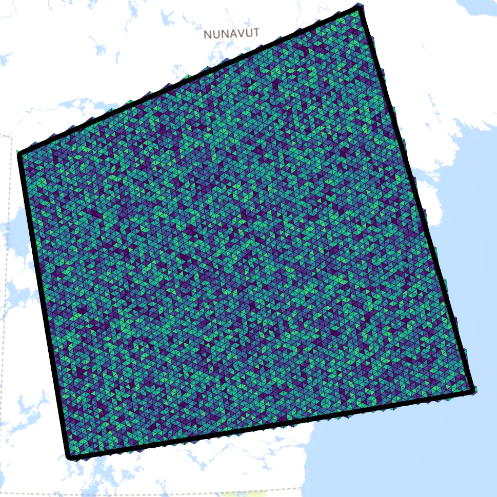
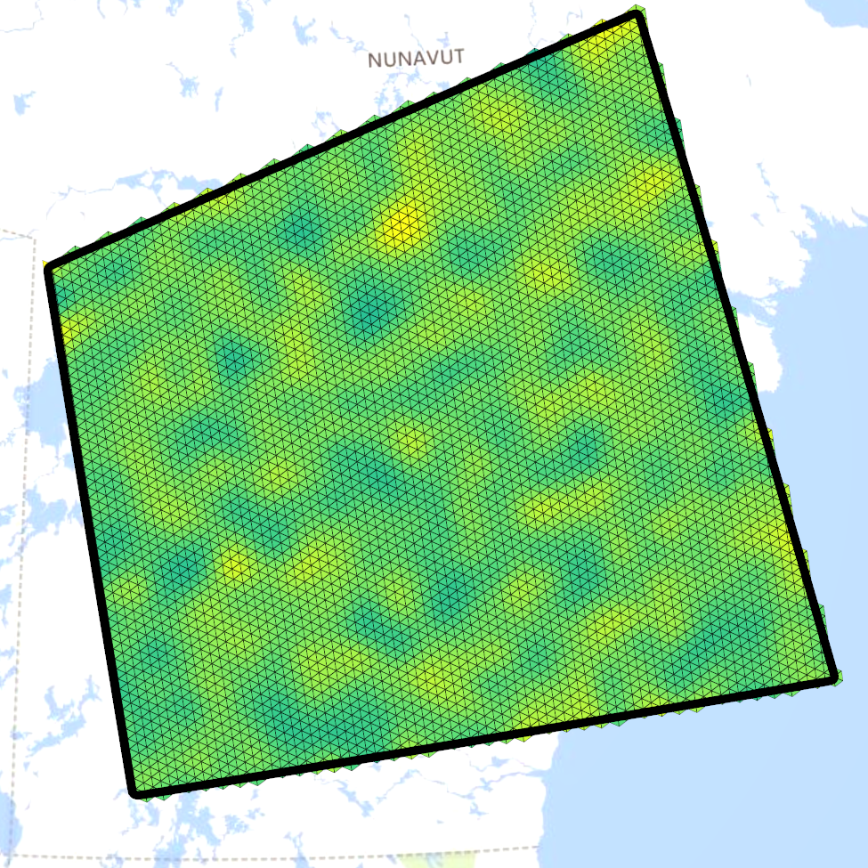
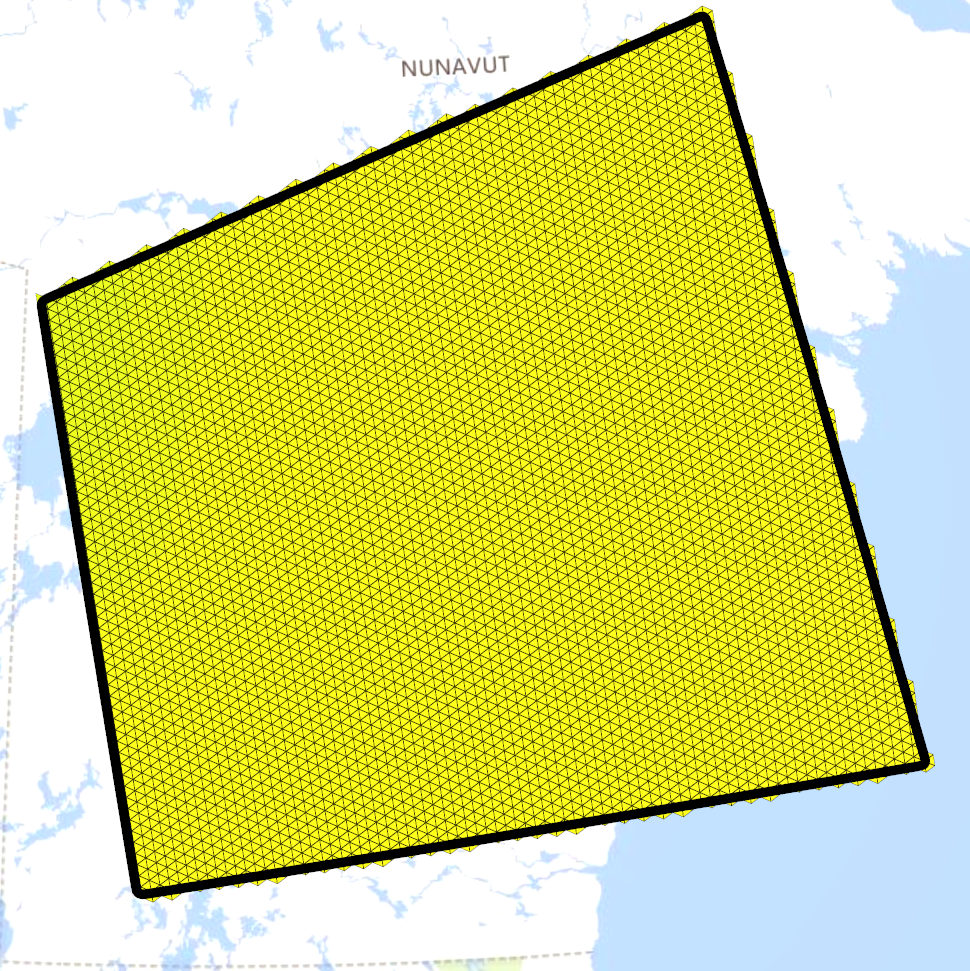

# Vegetation-Water-Feedback-Research-Project
Simulating vegetation-water feedback cycles on a mesh approximation of the earth

## Summary

This project was my research project for CPSC 615 (Computational Techniques for Graphics and Visualization) at the University of Calgary, Winter 2023. I implemented a simulation of the feedback cycles between water and vegetation. These types of feedback cycles lead to spatial patterns forming across the surface.

I implemented the simulation using a discrete global grid system (DGGS), which is a spatial data structure for earth data [1]. A DGGS is a mesh structure designed to handle large amounts of geospatial data at varying scales, which is a weakness of traditional GIS systems. The simulation was created by numerically approximating the solution to a set of reaction diffusion partial differential equations (PDE's) [2]. The PDE's were discretized in space using the DGGS grid, and were numerically discretized in time using Runge–Kutta numerical integration. I specifically used the RK4 method for this project.

## Results

Based on random initial conditions, it is possible to generate vegetation patterns similar to those used that are found in nature [3]. In the following results the color intensity corresponds to the vegetation density.

By setting the diffusion constant for vegetation to be an order of magnitude lower than the diffusion constant for water, spatial patterns are generated. Based on random initial conditions:

    

The results after integration:

If the diffusion constants are not of different magnitudes, then no spatial patterns are generated. Again starting from random initial conditions, the results after integration are mostly uniform in this case:

    

## Implementation

The model was implemented using C++, OpenGL for rendering and visualization, Eigen3 for matrix math, and OpenMP to parallelize and increase the speed of the numerical integration procedure. The DGGS libraries used are protected under an IP agreement, preventing the release of the source code.

## References

[1] Alderson, Troy, Matthew Purss, Xiaoping Du, Ali Mahdavi-Amiri, and Faramarz Samavati. 2020. “Digital Earth Platforms.” In Manual of Digital Earth, eds. Huadong Guo, Michael F. Goodchild, and Alessandro Annoni. Singapore: Springer Singapore, 25–54.

[2] HilleRisLambers, Reinier, Max Rietkerk, Frank van den Bosch, Herbert H. T. Prins, and Hans de Kroon. 2001. “Vegetation Pattern Formation in Semi-Arid Grazing Systems.” Ecology 82(1): 50–61.

[3] Meron, Ehud. 2019. “Vegetation Pattern Formation: The Mechanisms behind the Forms.” Physics Today 72(11): 30–36.
 
